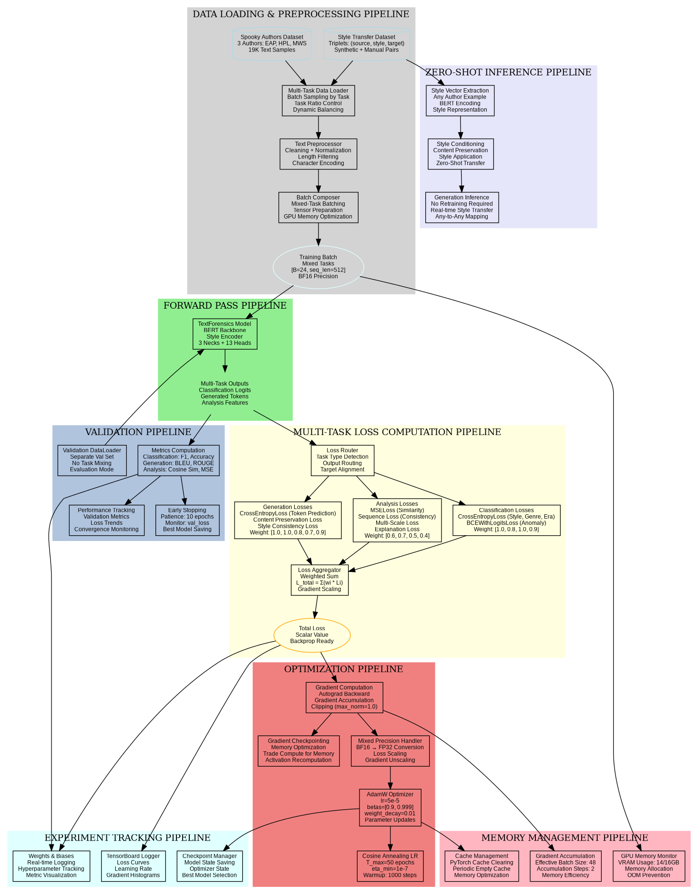

# TextForensics: Complete Multi-Task Neural Text Forensics Platform Documentation

## Project Overview
**TextForensics** is a comprehensive multi-task neural text forensics platform designed as a 6-month thesis project. The system leverages a unified transformer architecture with modular components, engineered for scalability, extensibility, and production deployment.

## Research Vision & Academic Contribution

### Primary Research Focus
- **Core Innovation**: Zero-shot style transfer using unified multi-task architecture
- **Timeline**: 6-month thesis deliverable with production-ready implementation
- **Academic Impact**: Demonstrating effectiveness of shared representations across diverse text forensics tasks

### Scalability Roadmap
- **Current Implementation**: 13 specialized task heads across 3 major categories
- **Extension Strategy**: Plug-and-play architecture enabling new tasks without backbone modifications
- **Long-term Vision**: Comprehensive text forensics platform for academic and industry applications

## Complete Architecture Specification

### Shared Foundation
- **Backbone**: BERT-base-uncased (110M parameters, pretrained)
- **Style Encoder**: Custom 768-dimensional universal style representation layer
- **Processing Pattern**: Backbone → Style Encoder → Task Necks → Specialized Heads
- **Memory Optimization**: RTX 5070 Ti optimized with BF16 precision, 16GB VRAM utilization

### Core Architecture Diagram


*Figure 1: Complete TextForensics neural architecture showing the flow from input text through BERT backbone, style encoder, task-specific necks, and specialized heads to final outputs. The diagram illustrates the modular design enabling 13 different task heads across classification, generation, and analysis categories.*

**Key Components:**
- **Input Stage**: Source text and style examples
- **Tokenization**: BERT WordPiece tokenizer (30,522 vocab)
- **Shared Backbone**: 12-layer transformer with 768-dimensional embeddings
- **Style Encoder**: Universal style representation layer
- **Task Necks**: Specialized feature extractors for Classification, Generation, and Analysis
- **Task Heads**: 13 specialized heads for different forensics tasks

## Complete ML Training Pipeline Diagram


*Figure 2: End-to-end machine learning pipeline for TextForensics, from data loading through training, validation, and zero-shot inference. Shows multi-task loss computation, memory management, and experiment tracking components optimized for RTX 5070 Ti hardware.*

**Pipeline Stages:**
- **Data Pipeline**: Multi-task data loading with batch composition
- **Forward Pass**: Unified model processing with task routing
- **Loss Computation**: Weighted multi-task loss aggregation
- **Optimization**: AdamW with cosine annealing and gradient checkpointing
- **Validation**: Comprehensive metrics across all task types
- **Memory Management**: GPU optimization for 16GB VRAM
- **Experiment Tracking**: W&B and TensorBoard integration
- **Zero-Shot Inference**: Real-time style transfer without retraining

## Technical Infrastructure & Implementation Details

### Hardware Optimization (RTX 5070 Ti)
- **Memory Management**: 16GB GDDR7 with 14GB allocation for training
- **Precision**: BF16 mixed precision for optimal RTX 50 series performance
- **Batch Configuration**: 24 samples with 2-step gradient accumulation
- **Sequence Length**: 512 tokens maximum for memory efficiency

### Software Stack
- **Framework**: PyTorch 2.0+ with native compilation
- **Configuration**: Hydra hierarchical config system
- **Containerization**: Docker GPU with CUDA 12.9
- **Monitoring**: Weights & Biases + TensorBoard integration
- **Development**: Pre-commit hooks, comprehensive testing, MLOps pipeline

### Zero-Shot Style Transfer Innovation
```
Training Phase: Learn universal style representations from triplets
Inference Phase: Extract style from ANY example → Apply to ANY text
Key Insight: Style vectors generalize across authors without retraining
```

## Development Guidelines

### Architectural Principles
- **Modularity**: Each head/neck is completely self-contained
- **Extensibility**: New tasks plug into existing necks without modification
- **Consistency**: Unified interfaces across all components
- **Scalability**: From 3 to 50+ authors without architectural changes

### Implementation Patterns
- **Interface-driven**: Abstract base classes ensure consistent contracts
- **Configuration hierarchy**: base.yaml → specific.yaml inheritance
- **Component boundaries**: Shared changes affect multiple tasks
- **Testing strategy**: Unit, integration, and end-to-end coverage

## Usage Instructions

### Development Setup
1. **Environment**: Review project tree structure
2. **Dependencies**: Request relevant implementation files (max 3-5)
3. **Context**: Maintain consistency with established patterns
4. **Timeline**: Prioritize zero-shot transfer while preserving extensibility

### File Request Protocol
When asking for development assistance:
- Specify current development status
- State specific question/task
- Provide current project tree
- Assistant will request minimal necessary files for context-efficient help

---

**This documentation serves as the complete technical specification for TextForensics development, covering architecture, implementation, and usage patterns for the 6-month thesis timeline.**
